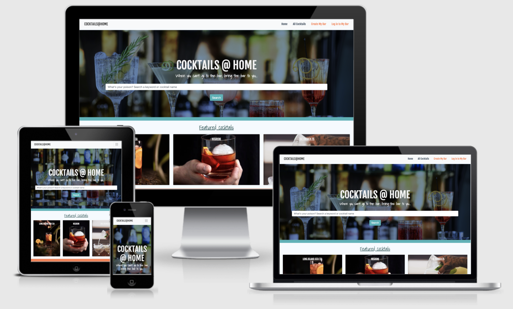
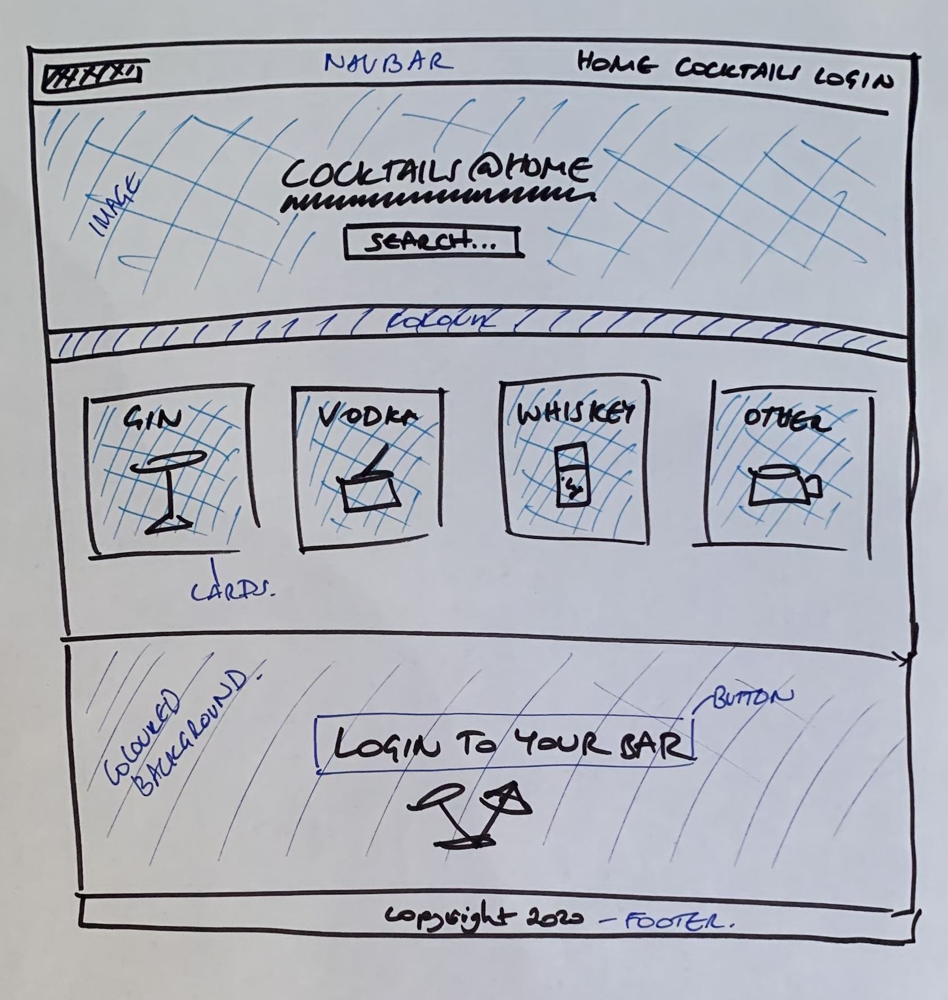
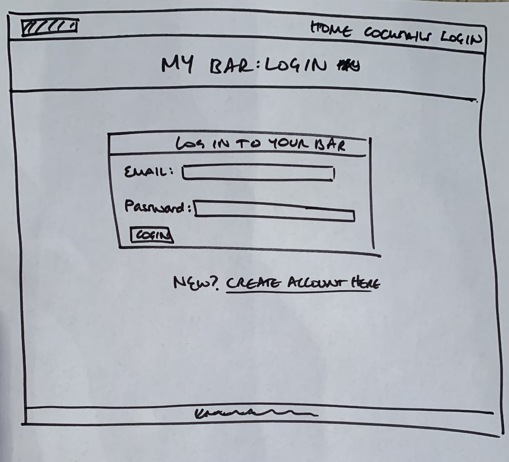
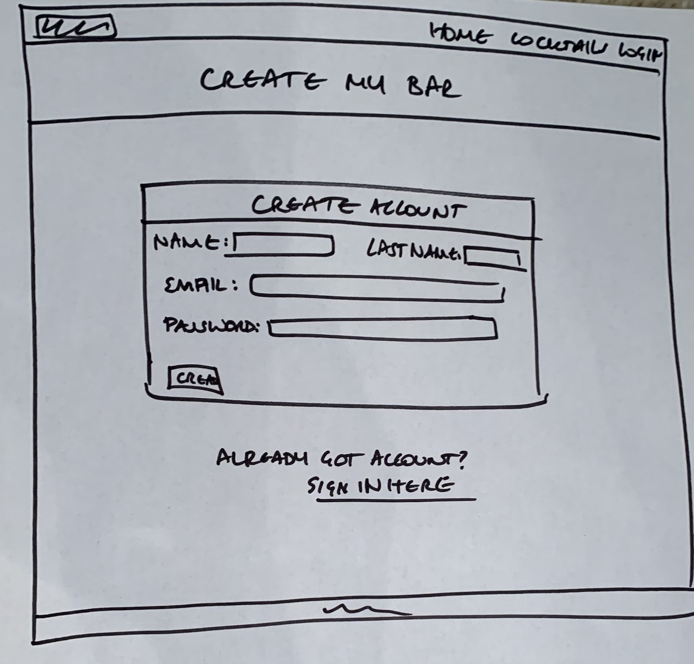
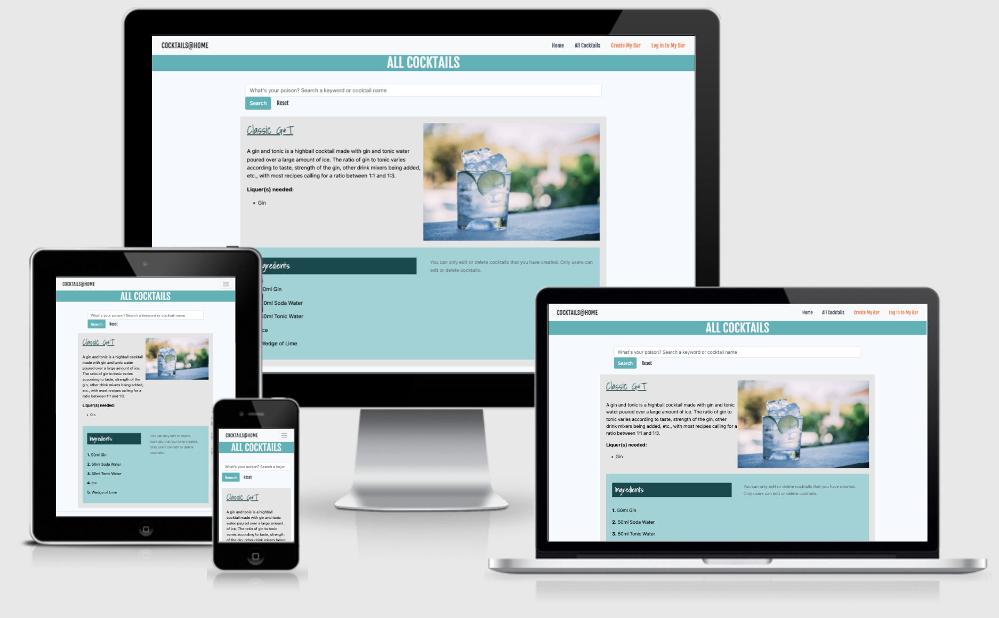
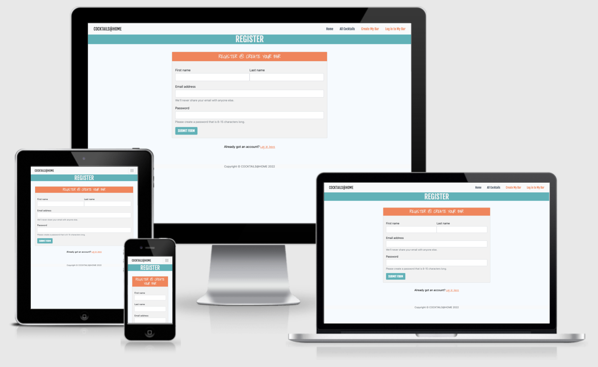
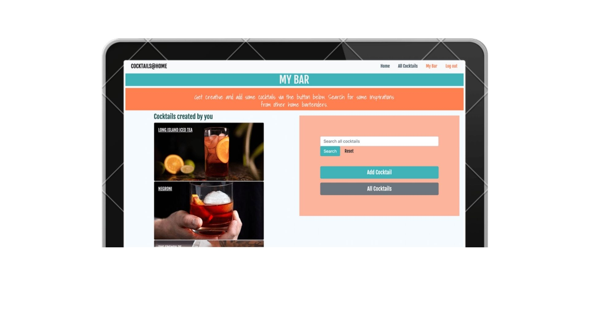

# Cocktails@Home
## Backend Development Milestone Project 3

The [Cocktails@Home](https://cocktails-at-home.herokuapp.com/) website was built by Kirstyn Luton as part of the Backend Development Milestone Project, Milestone 3 Project with Code Institute. The website presents an online cocktail database, hosted on MongoDB, where users can search for cocktail recipes and create a user account to create, update and delete their own recipes. 

Disclaimer: This website has been built for entertainment and education purposes. It does not represent an actual company. The website is build with HTML and CSS with imported Bootstrap, Flask, MongoDB, Python and Heroku frameworks. The website is responsive for multiple screen types.

## [View live website on Heroku App](https://cocktails-at-home.herokuapp.com/)
---

# Table of Contents

1. [UX](#ux)
    - [Website owner business goals](#website-owner-business-goals)
    - [User goals](#user-goals)
    - [User stories](#user-stories)
    - [Wireframes](#wireframes)
        - [Homepage - Wireframe](###homepage-wireframe)
        - [All cocktails - Wireframe](###join-us-page-wireframe)
        - [Log in - Wireframe](###members-page-wireframe)
        - [Register - Wireframe](###contact-us-page-wireframe)
    - [Surface](#surface)
2. [Features](#features)
3. [Technologies Used](#technologies-used)
4. [Testing](#testing)
    - [Functionality testing](#functionality-testing)
    - [Code Validation](#code-validation)
    - [User stories testing](#user-stories-testing)
    - [Issues found during site development](#issues-found-during-site-development)
5. [Deployment](#deployment)
6. [Credits](#credits)

# UX

## Website owner business goals

The website owner is the company, Cocktails@Home. The goal of the website is to provide users with an online tool to find cocktail receipes that they can use at home. The owner wants Cocktails@Home to be the 'go-to' website when looking for cocktail recepies. By providing the users with the functions to create and update their own recipes, the owner will increase their database collection of recipes.

Future goals for the owner will be to monitise the website and offer sales of alcoholic products to aid users Cocktails@Home experience.

## User goals

- General User's are able to find a cocktail receipe based on the name of the cocktail or liquer base of the cocktail.
- User is able to create an account.
- Logged in user is able to add and update their own recipes.
- Logged in user is able to easily see the recipes they have added to the site.

## User stories

User 1: Katie is 20, lives in london and loves cocktails. She tends to only like sweet cocktails but wants to find and try other other cocktails. As cocktails are expensive in London, she wants to find cheaper ways to make them from home. 

User 2: Peter is 40 and wants to have some friends over for a cocktail party. He has his favourites but wants to find some that all his guests might like. 

## Wireframes

### Homepage - Wireframe

### Cocktails Page - Wireframe

### Login Page - Wireframe

### Register Page - Wireframe

### My Bar Page - Wireframe

## Surface

### Colours

The main colours used in this project are: 

* #d6d6d6 - grey
* #40b3b9 - blue
* #ff7f50 - coral (My Bar/Log In accents)
* #f2f2f2 - off white

### Fonts

The fonts are installed from [Google Fonts](https://fonts.google.com/):

* h1, h2, h5: 'Fjalla One' with the secondary font as 'sans-serif'
* h3, h4: 'Shadows Into Light' with the secondary font as 'cursive'

### Images

I used images from [Unsplash.com](https://unsplash.com/). I have credited these in the [credits section.](#credits)

[Back to table of contents](#table-of-contents)

_______
# Features and functions

## Existing Features

### Base template // Elements on every page 
The base.html template houses the elements that are avaiable on everypage. 

#### Navigation bar 
The navigation bar aids the user in navigating around the website. Depending on the logged in state of the user, changes the visibility of the naviagtion links. 

#### Footer 
The footed displays the name of the website and current year. 

#### Flash message 
The flash messages provide feedback to the user based on their form actions. 

### Homepage

#### Welcome banner and hero image
This section welcomes the user and provides a search function to allow the user to search for a cocktail easily. 

#### Cocktail sections
Featured cocktails are displayed on the homepage. The user can click on these cocktails and see the specific recipe.

## All Cocktails Page 

#### 
The all cocktails page displays all cocktails in the MongoDb cocktails collection. It also displays a search bar function to allow the user to easily search for a cocktail recipe based on the cocktail name or ingredient. 

## Regsiter / Log In page

The log in and create a user pages host a form which is connected to the mongoDB database. The form allows the session user to create an account. If an account is created (verified by the email address), then they can log in with their password. 

## My Bar / Logged in user profile page

The My Bar page is only visible for users who have created an account. The page shows the cocktails which have been created by the logged in user. It also allows the user to add a cocktail of their own. 

## Future implementations

Further developments I would make to the sites features would be to add a favrouites function whereby a logged in user can add favourite cockatils to their "My Bar" page and see a summary of favourites. 

I would also develop a monitise aspect of the website and allow the company to sell products such as "Cocktails@Home" kits to allow users to create their favourite cocktails at home easily. 

[Back to table of contents](#table-of-contents)
_______

# Technologies Used

## Languages Used

* #### [Python](https://en.wikipedia.org/wiki/Python_(programming_language))
   Python is an interpreted high-level general-purpose programming language. Python was used to write..... 

* #### [HTML5](https://en.wikipedia.org/wiki/HTML5)
    HTML was used to build the website structure and overall layout. 

* #### [CSS3](https://en.wikipedia.org/wiki/CSS)
    CSS was used to style the website and build on the Bootstrap framework to customise the website. 

## Frameworks, Libraries and Programmes Used
   
* #### [Flask](https://en.wikipedia.org/wiki/Flask_(web_framework))
   Flask is a micro web framework written in Python.

* #### [MongoDB](https://www.mongodb.com/)
   MongoDB was used to store and retrieve data for the website. 

* #### [Bootstrap](https://getbootstrap.com/)
    Bootstrap 5.0 was used to assist with a responsive design and basic structure of the website.  

* #### [jsDelivr](https://www.jsdelivr.com/)
    jsDelivr was used with Bootstrap and aided the responsive and interactive elements of the site. 

* #### [Font Awesome](https://fontawesome.com/)
    Font Awesome was used to supply icons for the social links and 'Club Facilities' section. 

* #### [Google Fonts](https://fonts.google.com/) 
    Google Fonts were used to install the 'Bebas Neue' and 'Signika Negative' fonts which were used across the site. 

* #### [GitHub](https://github.com/)
    GitHub is used to store the project code. The code is pushed from GitPod to the GitHub respository. 

* #### [GitPod](https://www.gitpod.io/)
    Gitpod was used to write the code and the Git terminal was used for version control. The code was committed to Git and pushed to GitHub via the terminal. 

* #### [Heroku App](https://www.heroku.com)
    Heroku was used to deploy the overall project to ensure the Python languages work preoperly. 

* #### [Cloudinary](https://cloudinary.com/)
    Cloudinary was used to store the images and produce urls for the Mongo database collect of cocktails.

[Back to table of contents](#table-of-contents)
_______

# Testing

* The website testing was a continouse process throughout the project build. I continously tested the functions and pages before every commit to ensure they were working properly. 

### Functionality Testing

* I tested the functions as I created them to ensure they were working. 

### User Stories Testing

User 1:
<i>Katie</i>

* Visiting the website as Katie showed that the website was easy to use and easy to find new cocktails based on the liquer type. A development might be to include a scale on sweetness / bitterness of cocktails to allow users to search based on their prefernces. 

User 2:
<i>Peter</i>

* Visiting the website as Peter showed that the site allowed users to find cocktails easily. 

### Code Validation

* #### W3C Markup Validation Service - Confirmed results 

[Homepage](insertlink)

* #### W3C CSS Validation Service - Confirmed results - Using direct input CSS validation. 

### Issues Found During Site Development
* An issue found during the site development was trying to get the single_cocktail function pulling through with the cocktail name. As the cocktail name can't be gaurenteed as a unique reference, I decided to use the _id to show a single cocktail function.

[Back to table of contents](#table-of-contents)
_______
# Deployment

The project was created within Gitpod and then deployed to Heroku App via the Gitpod terminal. I committed and logged all changes to the project, into Githun using the git command control system. At the end of each session, I used the git push command in the GitPod terminal to push all changes to the GitHub repository. 

To deploy the project I had to type the following into the gitpod terminal:
* git add -A
* git commit -m "Insert commit message here"
* git push origin main 

This would save and push the changes to the git hub repository. Then, I log into Heroku and go to the following: 

* Heroku.app - deploy
* Scroll down to "manual deploy"
* Deploy brand - Main 
* Click: Deploy Branch

This would deploy the branch to the Heroku App and final link. 

[Back to table of contents](#table-of-contents)
_______
# Credits

## Content

The content on the page is from https://www.bbcgoodfood.com/.

## Media

#### Images: 

Homepage Hero Image: 
Photo by <a href="https://unsplash.com/@meeuwesen?utm_source=unsplash&utm_medium=referral&utm_content=creditCopyText">M.S. Meeuwesen</a> on <a href="https://unsplash.com/s/photos/cocktail-bar?utm_source=unsplash&utm_medium=referral&utm_content=creditCopyText">Unsplash</a>
  
Gin Category: 
Photo by <a href="https://unsplash.com/@soulvanschaik?utm_source=unsplash&utm_medium=referral&utm_content=creditCopyText">Soul van Schaik</a> on <a href="https://unsplash.com/s/photos/gin-drinks?utm_source=unsplash&utm_medium=referral&utm_content=creditCopyText">Unsplash</a>

Vodka Category: 
Photo by <a href="https://unsplash.com/@liz_weddon?utm_source=unsplash&utm_medium=referral&utm_content=creditCopyText">Liz Weddon</a> on <a href="https://unsplash.com/s/photos/vodka-drink?utm_source=unsplash&utm_medium=referral&utm_content=creditCopyText">Unsplash</a>
  
Gin and Tonic: 
Photo by <a href="https://unsplash.com/@tchompalov?utm_source=unsplash&utm_medium=referral&utm_content=creditCopyText">Vlad Tchompalov</a> on <a href="https://unsplash.com/s/photos/gin-and-tonic?utm_source=unsplash&utm_medium=referral&utm_content=creditCopyText">Unsplash</a>

Whiskey category: 
Photo by <a href="https://unsplash.com/@nuff?utm_source=unsplash&utm_medium=referral&utm_content=creditCopyText">Nuff .</a> on <a href="https://unsplash.com/s/photos/whiskey-cocktail?utm_source=unsplash&utm_medium=referral&utm_content=creditCopyText">Unsplash</a>

Cosmopolitan: 
Photo by <a href="https://unsplash.com/@kikesalazarn?utm_source=unsplash&utm_medium=referral&utm_content=creditCopyText">Kike Salazar N</a> on <a href="https://unsplash.com/s/photos/cosmopolitan?utm_source=unsplash&utm_medium=referral&utm_content=creditCopyText">Unsplash</a>

The French 75: 
Photo by <a href="https://unsplash.com/@alexasoh?utm_source=unsplash&utm_medium=referral&utm_content=creditCopyText">Alexa Soh</a> on <a href="https://unsplash.com/s/photos/french-75?utm_source=unsplash&utm_medium=referral&utm_content=creditCopyText">Unsplash</a>

Long Island Iced Tea: 
Photo by <a href="https://unsplash.com/@swivelproject?utm_source=unsplash&utm_medium=referral&utm_content=creditCopyText">Elissa Landry</a> on <a href="https://unsplash.com/s/photos/long-island-iced-tea?utm_source=unsplash&utm_medium=referral&utm_content=creditCopyText">Unsplash</a>

Mojito: 
Photo by <a href="https://unsplash.com/@neatproduction?utm_source=unsplash&utm_medium=referral&utm_content=creditCopyText">Andrejs Sims</a> on <a href="https://unsplash.com/s/photos/mojito-cocktail?utm_source=unsplash&utm_medium=referral&utm_content=creditCopyText">Unsplash</a>

Strawberry Daquari:
Photo by <a href="https://unsplash.com/@jenstheess?utm_source=unsplash&utm_medium=referral&utm_content=creditCopyText">Jens Theeß</a> on <a href="https://unsplash.com/s/photos/strawberry-daquari?utm_source=unsplash&utm_medium=referral&utm_content=creditCopyText">Unsplash</a>

Favicon icon: 
<a href="https://www.flaticon.com/free-icons/cocktail" title="cocktail icons">Cocktail icons created by Freepik - Flaticon</a>
  

#### README.md File Assistance

I used the following README.md files for assistance in structure and guidance on how to write a README.md file: 

* [README.md 1](https://github.com/KJLuton/RiversideRowingClub/blob/master/README.md)

#### Code:

To write the code I used tutorials from the Code Institute lessons (Backend Development).

I also used the following links to support my code writing: 
* [Bootstrap Nav Bar](https://getbootstrap.com/docs/5.0/components/navbar/)
* [Bootstrap Cards](https://getbootstrap.com/docs/5.0/components/card/)
* [Bootstrap Forms](https://getbootstrap.com/docs/5.0/forms/overview/)
* [Creating a favicon](https://www.digitalocean.com/community/tutorials/how-to-add-a-favicon-to-your-website-with-html)

# Acknowledgements

Thank you to my mentor Antonija (slack:antonija_mentor) for her support and guidance during the project development. 
 
 
Thank you to my family and friends who tested the site and provided valuable feedback. 

[Back to Table of contents](#table-of-contents)

